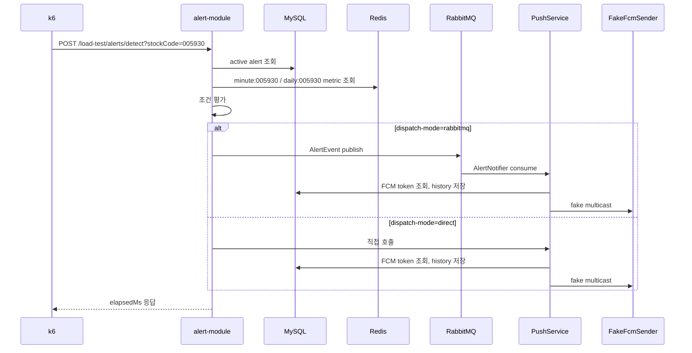
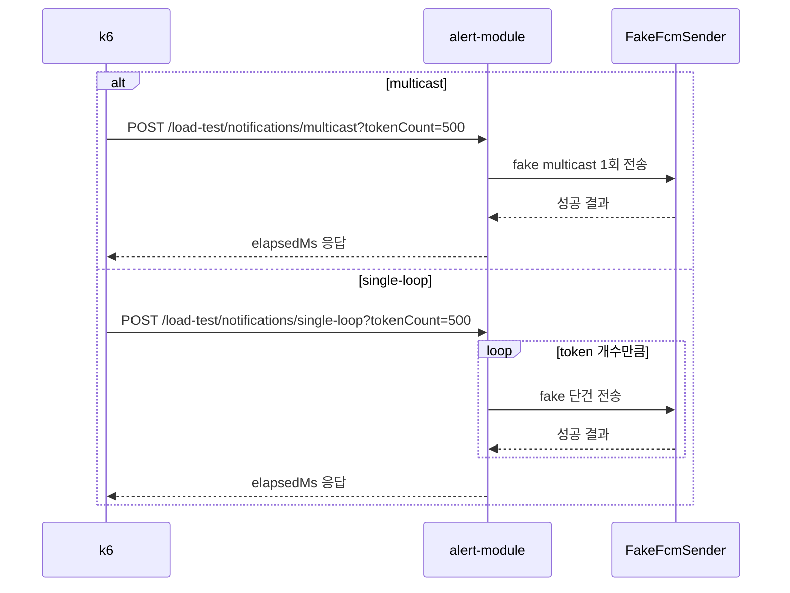

# 부하테스트 실험 가이드

이 문서는 `alert-module`의 알림 처리 성능을 포트폴리오용으로 비교하기 위한 실행 가이드입니다.

Grafana는 부하를 만드는 도구가 아니라 결과를 보는 도구입니다. 실제 부하는 k6가 만들고, 애플리케이션/JVM 메트릭은 Prometheus가 수집하며, k6 결과는 InfluxDB에 저장해서 Grafana에서 봅니다.

추가한 코드의 역할과 내부 흐름은 `load-test/CODE_WALKTHROUGH.md`에 따로 정리했습니다.

## 1. 실험 목표

비교하고 싶은 구조는 두 가지입니다.

1. RabbitMQ 비동기 방식
   - 알림 조건이 충족되면 `AlertEventPublisher`가 RabbitMQ에 메시지를 넣습니다.
   - RabbitMQ consumer인 `AlertNotifier`가 메시지를 꺼내서 `PushService`를 실행합니다.
   - 요청 처리 흐름과 알림 전송 흐름이 분리됩니다.

2. Direct 동기 방식
   - 알림 조건이 충족되면 `AlertEventPublisher`가 RabbitMQ를 거치지 않고 `PushService`를 바로 호출합니다.
   - 조건 평가 요청 안에서 알림 처리까지 같이 수행됩니다.

포트폴리오에서는 같은 데이터와 같은 부하를 주고, 두 방식의 p95 응답시간, 처리량, JVM/DB/RabbitMQ 상태를 비교하면 됩니다.

## 2. 실험에 쓰는 파일

| 파일 | 역할 |
| --- | --- |
| `load-test/docker-compose.yml` | Redis, RabbitMQ, MySQL, Prometheus, InfluxDB, Grafana 실행 |
| `load-test/mysql/01-schema.sql` | 엔티티 기준 MySQL 테이블 생성 |
| `load-test/mysql/02-seed.sql` | 사용자, FCM 토큰, 회사, 알림, 캔들 가상 데이터 생성 |
| `load-test/scripts/seed-redis.sh` | 알림 평가가 읽는 Redis metric 생성 |
| `load-test/k6/alert-detect.js` | 알림 조건 평가 부하테스트 |
| `load-test/k6/notification-multicast.js` | FCM multicast 부하테스트 |
| `load-test/k6/notification-send-mode.js` | FCM multicast vs 단건 반복 전송 비교 |
| `alert-module/src/main/resources/application-loadtest.yml` | 로컬 부하테스트용 Spring profile |

## 3. 실험 데이터 규모

기본 seed 데이터는 다음 규모입니다.

| 데이터 | 개수 |
| --- | ---: |
| 사용자 | 100명 |
| FCM 토큰 | 500개 |
| 회사/종목 | 5개 |
| 알림 | 2,000개 |
| 알림 조건 매핑 | 2,000개 |
| 일봉 데이터 | 300개 |
| 분봉 데이터 | 600개 |
| Redis metric key | 10개 |

알림은 종목별로 분산되어 있습니다. k6가 `/load-test/alerts/detect`를 호출하면 해당 종목의 활성 알림을 조회하고 조건을 평가합니다.

## 4. 전체 동작 흐름

### 4.1 알림 조건 평가 실험



### 4.2 FCM multicast vs 단건 반복 전송 실험



실제 Firebase를 호출하지 않습니다. `loadtest` profile에서는 `alert.fcm.mode=fake`로 동작해서 외부 네트워크나 Firebase 제한이 실험 결과를 흐리지 않게 합니다.

이 실험의 비교 기준은 `토큰 수`가 아니라 `전송 방식`입니다. 같은 500개 토큰을 multicast 1회로 보낼 때와 단건 전송 500회로 보낼 때의 응답시간 차이를 봅니다.

## 5. 실행 순서

### 5.1 인프라 실행

프로젝트 루트에서 실행합니다.

```bash
docker compose -f load-test/docker-compose.yml up -d
```

실행 후 확인합니다.

```bash
docker compose -f load-test/docker-compose.yml ps
```

확인할 주소:

| 서비스 | 주소 | 계정 |
| --- | --- | --- |
| Grafana | http://localhost:3000 | `admin` / `admin` |
| RabbitMQ Management | http://localhost:15672 | `admin` / `admin123` |
| Prometheus | http://localhost:9090 | 없음 |
| MySQL | `localhost:3307` | `admin` / `andand123123!` |
| Redis | `localhost:6379` | 없음 |

### 5.2 MySQL seed 확인

MySQL init SQL은 Docker volume이 처음 생성될 때 자동 실행됩니다.

```bash
docker exec -it $(docker compose -f load-test/docker-compose.yml ps -q mysql) mysql -uadmin -pandand123123! andDB
```

MySQL 접속 후 확인:

```sql
SELECT COUNT(*) FROM user;
SELECT COUNT(*) FROM fcm_token;
SELECT COUNT(*) FROM alert;
SELECT COUNT(*) FROM alertConditionManager;
SELECT COUNT(*) FROM daily_candle;
SELECT COUNT(*) FROM minuteCandle;
```

기대값:

| 쿼리 | 기대값 |
| --- | ---: |
| `user` | 100 |
| `fcm_token` | 500 |
| `alert` | 2000 |
| `alertConditionManager` | 2000 |
| `daily_candle` | 300 |
| `minuteCandle` | 600 |

데이터를 처음부터 다시 만들고 싶으면 volume을 삭제합니다.

```bash
docker compose -f load-test/docker-compose.yml down -v
docker compose -f load-test/docker-compose.yml up -d
```

### 5.3 Redis seed 입력

```bash
bash load-test/scripts/seed-redis.sh
```

확인:

```bash
redis-cli keys '*:*'
redis-cli get minute:005930
redis-cli get daily:005930
```

`minute:*`에는 현재가, 거래량 비율, 시가 대비 등락률이 들어있고, `daily:*`에는 RSI, SMA, Bollinger 값이 들어있습니다.

### 5.4 alert-module 실행

RabbitMQ 비동기 방식:

```bash
env JAVA_HOME=/Library/Java/JavaVirtualMachines/temurin-21.jdk/Contents/Home \
./gradlew :alert-module:bootRun --args='--spring.profiles.active=loadtest --alert.notification.dispatch-mode=rabbitmq'
```

Direct 동기 방식:

```bash
env JAVA_HOME=/Library/Java/JavaVirtualMachines/temurin-21.jdk/Contents/Home \
./gradlew :alert-module:bootRun --args='--spring.profiles.active=loadtest --alert.notification.dispatch-mode=direct'
```

서버 실행 확인:

```bash
curl http://localhost:8083/actuator/health
```

`UP`이 나오면 정상입니다.

## 6. 실험 실행

### 6.1 알림 평가 부하테스트

RabbitMQ 방식으로 서버를 켠 상태에서:

```bash
K6_OUT=influxdb=http://localhost:8086/k6 k6 run load-test/k6/alert-detect.js
```

그 다음 서버를 끄고 Direct 방식으로 다시 실행한 뒤 같은 명령을 반복합니다.

비교할 때는 실험 이름을 메모해두세요.

| 실험명 | 서버 옵션 |
| --- | --- |
| `alert-detect-rabbitmq` | `--alert.notification.dispatch-mode=rabbitmq` |
| `alert-detect-direct` | `--alert.notification.dispatch-mode=direct` |

### 6.2 FCM multicast vs 단건 반복 부하테스트

```bash
SEND_MODE=multicast TOKEN_COUNT=500 K6_OUT=influxdb=http://localhost:8086/k6 k6 run load-test/k6/notification-send-mode.js
SEND_MODE=single-loop TOKEN_COUNT=500 K6_OUT=influxdb=http://localhost:8086/k6 k6 run load-test/k6/notification-send-mode.js
```

토큰 수를 바꿔 추가 실험을 하고 싶으면:

```bash
SEND_MODE=multicast TOKEN_COUNT=100 K6_OUT=influxdb=http://localhost:8086/k6 k6 run load-test/k6/notification-send-mode.js
SEND_MODE=single-loop TOKEN_COUNT=100 K6_OUT=influxdb=http://localhost:8086/k6 k6 run load-test/k6/notification-send-mode.js
```

## 7. 어디서 무엇을 확인할까

### 7.1 터미널 k6 결과

k6 실행이 끝나면 터미널에 요약이 나옵니다.

중요하게 볼 값:

| 지표 | 의미 |
| --- | --- |
| `http_req_duration avg` | 평균 응답시간 |
| `http_req_duration p(95)` | 느린 5% 요청의 응답시간 |
| `http_req_failed` | 실패율 |
| `http_reqs` | 총 요청 수 |
| `iterations` | 시나리오 반복 횟수 |

포트폴리오에는 평균보다 `p95`를 강조하는 것이 좋습니다. 부하 상황에서는 평균보다 꼬리 지연이 더 설득력 있습니다.

### 7.2 Grafana

주소: http://localhost:3000

Datasource는 자동으로 두 개가 잡힙니다.

| Datasource | 보는 값 |
| --- | --- |
| Prometheus | JVM, HTTP server, process metric |
| k6 InfluxDB | k6 요청 시간, 요청 수, VU |

처음에는 직접 Explore에서 확인하면 됩니다.

Prometheus에서 볼 만한 query:

```promql
http_server_requests_seconds_count
http_server_requests_seconds_sum
jvm_memory_used_bytes
jvm_threads_live_threads
process_cpu_usage
hikaricp_connections_active
hikaricp_connections_pending
```

k6 InfluxDB에서는 다음 measurement를 보면 됩니다.

```text
http_req_duration
http_reqs
vus
iterations
```

### 7.3 RabbitMQ Management

주소: http://localhost:15672

볼 곳:

1. `Queues and Streams`
2. `alert.company.queue`
3. `alert.condition.queue`

중요하게 볼 값:

| 항목 | 의미 |
| --- | --- |
| Ready | 아직 처리되지 않은 메시지 수 |
| Unacked | consumer가 처리 중인 메시지 수 |
| Total | 전체 메시지 흐름 |
| Publish rate | 메시지가 들어오는 속도 |
| Deliver rate | consumer가 가져가는 속도 |

RabbitMQ 방식 실험에서 `Ready`가 계속 쌓이면 consumer 처리량보다 publish 속도가 빠르다는 뜻입니다. 이 경우 비동기 구조가 요청을 빠르게 반환하지만, 알림 처리는 뒤로 밀릴 수 있다는 해석을 할 수 있습니다.

Direct 방식에서는 RabbitMQ queue가 거의 움직이지 않아야 정상입니다.

### 7.4 MySQL

확인할 테이블:

```sql
SELECT COUNT(*) FROM alertHistory;
SELECT COUNT(*) FROM alert WHERE is_triggered = b'1';
SELECT stock_code, COUNT(*) FROM alert GROUP BY stock_code;
```

`alertHistory`가 증가하면 실제 알림 처리 흐름이 실행된 것입니다.

주의: 같은 seed 상태에서 계속 실험하면 `alert.is_triggered` 상태가 바뀌어 이후 실험의 알림 발생량이 달라질 수 있습니다. 공정 비교가 필요하면 실험 전 아래처럼 상태를 초기화하세요.

```sql
UPDATE alert SET is_triggered = b'0', last_notified_at = NULL;
DELETE FROM alertHistory;
```

### 7.5 Redis

확인:

```bash
redis-cli get minute:005930
redis-cli get daily:005930
```

조건 평가 결과를 바꾸고 싶으면 Redis 값을 바꾸면 됩니다.

예를 들어 가격 조건이 더 잘 터지게 하려면:

```bash
redis-cli set minute:005930 '{"price":80000,"volumeRatio":150,"volume":150000,"diffFromOpen":900,"diffFromOpenPct":1.3,"diffFromHigh52wPct":-2.1,"diffFromLow52wPct":18.0}'
```

## 8. 실험 결과 해석 예시

### RabbitMQ 방식이 더 좋아 보이는 경우

관찰:

- k6 p95가 direct보다 낮다.
- RabbitMQ queue에 메시지가 잠깐 쌓였다가 소비된다.
- API 응답은 빠르고, 알림 처리는 뒤에서 처리된다.

해석:

> RabbitMQ를 사용해 조건 평가 요청과 알림 전송을 분리하니, 요청 스레드가 FCM/히스토리 저장 처리에 묶이지 않아 응답시간이 안정화되었다.

### Direct 방식이 불리해 보이는 경우

관찰:

- k6 p95가 높다.
- 요청이 많을수록 API 응답시간이 증가한다.
- DB connection active/pending이 증가한다.

해석:

> Direct 방식은 구현은 단순하지만 알림 전송과 히스토리 저장이 요청 흐름 안에 포함되어, 부하가 높아질수록 API latency가 증가한다.

### RabbitMQ 방식의 단점도 같이 적기

포트폴리오에서는 장점만 쓰면 약해 보입니다.

같이 적을 단점:

- 메시지 브로커 운영 비용이 추가된다.
- queue backlog 모니터링이 필요하다.
- consumer 장애 시 알림 지연이 발생할 수 있다.
- 최종 일관성 구조라 즉시 처리 보장이 약해진다.

## 9. 자주 막히는 부분

### MySQL seed가 안 들어간 것 같을 때

MySQL Docker init script는 DB volume이 처음 만들어질 때만 실행됩니다.

```bash
docker compose -f load-test/docker-compose.yml down -v
docker compose -f load-test/docker-compose.yml up -d
```

### `k6: command not found`

macOS라면:

```bash
brew install k6
```

### `redis-cli: command not found`

macOS라면:

```bash
brew install redis
```

또는 Docker container 안에서 실행:

```bash
docker exec -it $(docker compose -f load-test/docker-compose.yml ps -q redis) redis-cli keys '*:*'
```

### Gradle이 Java 버전 에러를 낼 때

이 프로젝트는 아래처럼 Java 21을 지정해서 실행하세요.

```bash
env JAVA_HOME=/Library/Java/JavaVirtualMachines/temurin-21.jdk/Contents/Home ./gradlew :alert-module:compileJava
```

## 10. 포트폴리오에 넣을 표

실험 후 아래 표를 채우면 됩니다.

| 실험 | VU | 총 요청 수 | 실패율 | 평균 응답시간 | p95 응답시간 | 메모 |
| --- | ---: | ---: | ---: | ---: | ---: | --- |
| Direct | 20 |  |  |  |  | 요청 안에서 알림 처리 |
| RabbitMQ | 20 |  |  |  |  | 알림 처리 비동기화 |
| FCM multicast 500 tokens | 20 |  |  |  |  | fake FCM 1회 호출 |
| FCM single-loop 500 tokens | 20 |  |  |  |  | fake FCM 500회 호출 |

## 11. 추천 실험 순서

1. 인프라 실행
2. MySQL count 확인
3. Redis seed 입력 및 확인
4. RabbitMQ 방식으로 alert-module 실행
5. `alert-detect.js` 실행
6. Grafana/RabbitMQ/k6 결과 캡처
7. DB 상태 초기화
8. Direct 방식으로 alert-module 재실행
9. 같은 k6 실험 반복
10. 결과 표 작성

DB 상태 초기화 SQL:

```sql
UPDATE alert SET is_triggered = b'0', last_notified_at = NULL;
DELETE FROM alertHistory;
```
